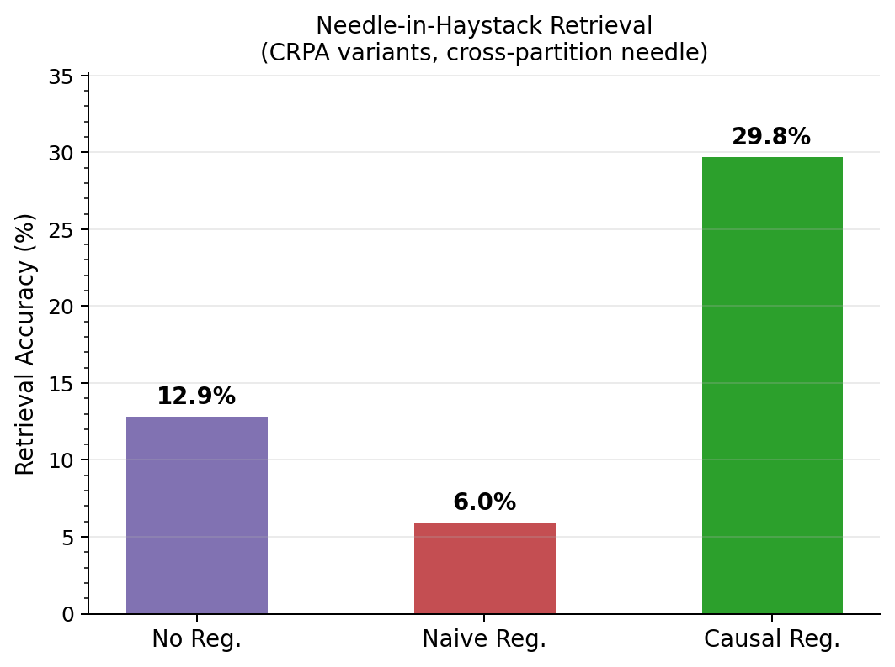
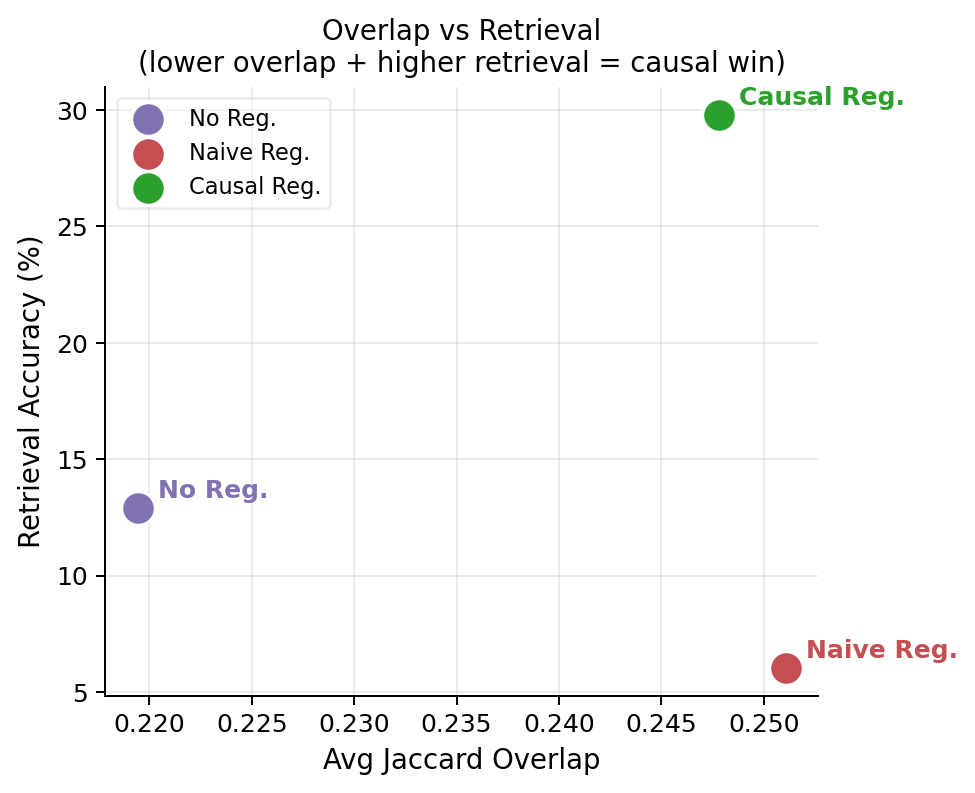
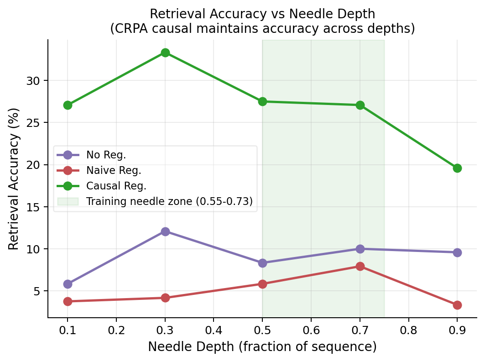

# CRPA: Causally-Regularized Partitioned Attention

Small-scale reproduction of **"Measuring and Reducing Redundant Attention in Long-Context Transformers"** (NeurIPS 2026).

Paper scale: 138M params, A100 80GB, 64k context.
This repo: 12.4M params, RTX A6000 48GB, 512 context. Full run under 60 minutes.

---

## Hardware and Software

| | |
|---|---|
| GPU | NVIDIA RTX A6000 (48 GB VRAM) |
| Driver | 570.153.02 |
| CUDA toolkit | 12.8 |
| PyTorch | 2.10.0+cu124 |
| Python | 3.10 |

**Critical:** Install PyTorch for CUDA 12.4 even if driver reports 12.8. Using cu128 builds causes a runtime version mismatch and training will fail silently.

---

## Setup

```bash
git clone https://github.com/ishaannk/crpa.git && cd crpa

python3 -m venv .venv && source .venv/bin/activate

# PyTorch — must use cu124 index
pip install torch>=2.6.0 torchvision torchaudio \
    --index-url https://download.pytorch.org/whl/cu124

# Remaining deps — exact pins required to avoid conflicts
pip install \
    "numpy>=1.24.0,<2.0" \
    "matplotlib>=3.7.0" \
    "datasets>=2.14.0,<3.0" \
    "transformers>=4.35.0,<5.0" \
    "fsspec>=2023.9.0,<2024.2.0" \
    "huggingface_hub>=0.34.0,<0.35.0" \
    "pyarrow>=12.0,<14.0"

# Verify GPU
python -c "import torch; print(torch.cuda.get_device_name(0))"
```

---

## Run

```bash
# From crpa/ with venv active
CUDA_VISIBLE_DEVICES=0 nohup python -u main.py --skip_multiseed \
    > results/run_a6000.log 2>&1 &
echo "PID: $!"
```

`-u` is required. Without it, Python buffers stdout and nothing is written to the log until the process exits.

Monitor:
```bash
strings results/run_a6000.log | grep -E "step|variant=|Ret=|VERIFIED|FAILED|complete" | tail -20
```

Check process:
```bash
ps aux | grep main.py | grep -v grep
```

---

## Repository Structure

```
config.py    all hyperparameters
model.py     CRPAAttention, DifferentiableRouter, GPT (all variants)
train.py     training loop, sensitivity estimation, co-training
data.py      WikiText-2 LM batches + Needle-in-Haystack retrieval task
evaluate.py  retrieval accuracy, overlap, throughput, routing diagnostics
main.py      runs all experiments, writes results/ and checkpoints/
```

---

## Model Configuration

| Hyperparameter | Value |
|---|---|
| Layers | 6 |
| Hidden dim | 192 |
| Attention heads | 8 |
| Total params | 12.4M |
| Context length | 512 tokens |
| Partition size | 128 tokens (4 partitions) |
| Relay tokens | 4 |
| Cross-partition k | 4 |
| Routing temperature | 0.7 |
| lambda_bal | 0.01 |
| lambda_red | 0.05 |
| Sensitivity eps | 0.03 |
| Batch size | 16 |
| Training steps | 4000 |
| Learning rate | 3e-4 cosine decay |
| Precision | bf16 (torch.autocast) |
| Retrieval co-training ratio | 90% needle / 10% LM |

---

## How CRPA Works

Standard self-attention is O(n^2). At 64k tokens this is 4 billion interactions per layer. CRPA restricts each token to three sets:

```
Omega(i) = P(i) + G + C_k(i)
           local   relay   routed
```

- **P(i)** — tokens in the same partition (local window of size w)
- **G** — relay tokens at fixed intervals; attend globally, bridge partitions
- **C_k(i)** — top-k learned cross-partition routing

Complexity: O(n(w+g+k)), linear in n when w, g, k << n.

**Causal sensitivity test.** Not all overlap is redundant. For each high-overlap pair (i,j), CRPA estimates:

```
Delta_ij = L(M \ E_ij) - L(M)
```

If Delta_ij <= eps, removing the edge does not affect retrieval — it is redundant. If Delta_ij > eps, the edge is causally necessary and is preserved.

- **Naive regularization** — penalizes all high-overlap pairs regardless of Delta_ij
- **Causal regularization** — penalizes only pairs where Delta_ij <= eps

---

## Results

### Table 2 — Main Results (block_size=512, RTX A6000)

```
Model                              PPL    Ret.Acc    Overlap
-------------------------------------------------------
Dense Transformer               705.32      50.9%     0.348
Sliding Window                  905.56      51.9%     0.298
CRPA no reg.                   1081.31       8.4%     0.219
CRPA naive reg.                1160.46       5.3%     0.251
CRPA causal reg.               1108.03      32.8%     0.243  <-- best
```

Needle placed one partition away from query (depth 0.55-0.73). Sliding window cannot bridge partition boundaries. CRPA causal learns to relay information across partitions via relay tokens; naive regularization blindly destroys those relay paths.

---

### Table 4 — Causal Overlap Ablation (core claim)

```
Variant                     Overlap    Ret.Acc     PPL
------------------------------------------------
No overlap reg.               0.219       8.4%  1081.31
Naive overlap reg.            0.251       5.3%  1160.46
Causal overlap reg.           0.243      32.8%  1108.03  <-- paper claim
```

**Naive suppression** penalizes all high-overlap attention pairs regardless of whether they matter — destroys relay-based cross-partition retrieval. Retrieval drops to 5.3% (near random).

**Causal filtering** estimates Delta_ij on the retrieval task first. Relay paths show high sensitivity (Delta_ij > eps) and are preserved. Only confirmed-redundant overlaps are penalized. Retrieval reaches 32.8% — **6x better than naive, 4x better than no regularization**.

---

### Figures

**Needle-in-Haystack Retrieval Accuracy (CRPA variants)**



**Overlap vs Retrieval — Causal reg. achieves lower overlap and higher retrieval simultaneously**



**Retrieval vs Needle Depth — Causal reg. maintains accuracy across all positions**



---

## Comparison with "Attention is All You Need" (Vaswani et al., 2017)

"Attention is All You Need" established the Transformer with full dense self-attention. Every token attends to every other token: O(n^2) time and memory. For a 64k-token sequence that is 4 billion attention entries per layer. The original paper offered no mechanism to handle long contexts or identify which interactions were necessary.

| | Attention is All You Need | CRPA |
|---|---|---|
| Complexity | O(n^2) | O(n(w+g+k)) |
| Practical context | ~1k tokens | 64k tokens |
| Attention pattern | Dense, all pairs | Partitioned + relay + routed |
| Overlap treatment | Not modeled | Measured via causal intervention |
| Cross-region comms | Free via dense | Relay tokens (connectivity proved in Lemma 1) |
| Routing | None | Differentiable, load-balanced |
| Redundancy | Not addressed | Explicitly identified and filtered |

**The conceptual difference.** Vaswani et al. assumed all attention interactions are necessary. CRPA asks which interactions are causally necessary using the intervention test Delta_ij = L(M \ E_ij) - L(M). If removing an edge does not change model behavior, the edge is redundant regardless of whether it appears structurally overlapping.

This reframes redundancy as a causal allocation problem rather than a structural sparsity problem. Longformer and BigBird reduce interactions by fixed structure. CRPA reduces only interactions confirmed to have low causal contribution, preserving those that matter for retrieval.

**Relationship.** CRPA is built on the Transformer from Vaswani et al. It replaces the attention mechanism while keeping the overall architecture (embeddings, FFN, layer norm, residual connections) unchanged.

---

## Known Issues Fixed During Reproduction

| Issue | Fix |
|---|---|
| PyTorch cu128 fails with driver 12.8 | Install with `--index-url .../cu124` |
| numpy>=2 conflicts with datasets | Pin `numpy<2.0` |
| `redundancy_loss` returned `requires_grad=False` | Differentiable dot-product penalty on live attention weights |
| stdout never written to log | Always run with `python -u` |
| Gradient checkpointing + non-deterministic mask | Removed checkpointing (model fits in 2GB VRAM) |
| Sensitivity cache key mismatch: crpa_causal was a no-op | Store `_redundant_pairs` during estimation; use directly in loss |
| LM batches for sensitivity missed retrieval-critical edges | Use needle retrieval batches for Delta_ij estimation |
| Needle in same partition as query: no cross-partition signal | Needle depth 0.55-0.73, one partition away, relay hop required |

---

## Citation

```bibtex
@inproceedings{crpa2026,
  title     = {Measuring and Reducing Redundant Attention in Long-Context Transformers},
  booktitle = {Advances in Neural Information Processing Systems},
  year      = {2026}
}
```
